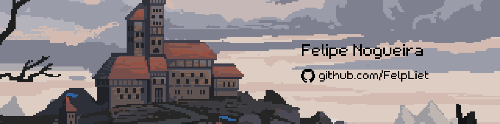

# Hi 🐦‍⬛👍🏻, Welcome to My Profile!

### 👋 Hello! My name is **Felipe**  
I am a **Computer Science student** at UFC Russas, passionate about:  
- 🌐 **Web Development**  
- 🎮 **Game Development**  
- 📡 **IoT (Internet of Things)** 
- 🤖 **AI Solutions** 

Currently, I’m working as a **Front-End Developer** on **Medusa's Eye**.  

---

## 🛠️ Technologies & Tools

Here are some tools and technologies I’ve been working with lately:

---

## 🌟 About Me

- 🧩 I love solving complex problems and creating engaging user experiences.
- 📚 I’m always learning new technologies to expand my skillset.
- 🤖 Curiosity: I'm fascinated by the power of AI and aspire to build things I imagine using AI-driven solutions.
- 🎨 Fun Fact: I dream of creating a website featuring 3D elements that I model myself!

---

## 📈 GitHub Stats

---

## 📫 How to Reach Me

- 📧 **Email**: [felipe.leite23@gmail.com](mailto:felipe.leite23@gmail.com)  
- 💼 **LinkedIn**: [linkedin.com/in/felpliet](https://linkedin.com/in/felpliet)  
- 🌐 **Portfolio**: Soon!

---

## 🎯 Goals

- 🌱 Grow as a full-stack developer.  
- 🛠️ Contribute to open-source projects.  
- 💡 Explore innovative solutions in IoT.

---

Thanks for visiting! 🚀
